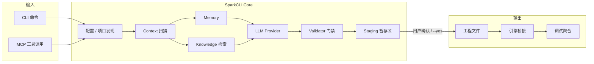

# SparkCLI - 游戏开发者AI助手

> 文档版本：**v1.0 完整产品规格** | 最后更新：2026-05  
> 说明：v1.0 以「可交付的完整产品」为目标描述全部能力；文末 **§完整度审计** 列出模块成熟度与待细化项。

## 🎯 产品定位

**SparkCLI** - 面向游戏开发者的垂直 AI CLI 助手

**一句话**：让独立游戏开发者用一行命令完成过去需要在多个软件间反复切换的工作

**差异化（相对通用 AI 编程工具）**：

| 维度 | 通用 AI CLI / IDE Agent | SparkCLI |
|------|-------------------------|---------|
| 项目理解 | 通用代码树 | 场景图、组件依赖、资源引用、引擎 meta |
| 输出物 | 任意源码 | 可编译的游戏脚本 + 可选场景/预制体变更 |
| 平台约束 | 无 | 微信包体、分包、首屏、DrawCall 等内置规则 |
| 工具协议 | 各异 | 标准 MCP，可被 Cursor / Claude / Windsurf 复用 |
| 离线能力 | 弱 | 模板 + 静态检查 + `doctor` 不依赖模型 |
| **模型** | 绑定单一 IDE 模型 | **用户自选 Provider/模型**，CLI/配置/单次命令均可指定 |

---

## 😣 解决的核心痛点

### 1. UI逻辑与美术割裂
**现状**：美术给图 → 开发者手动写UI代码 → 反复调整 → 效率低  
**方案**：AI理解UI描述 → 自动生成组件代码 → 经校验后可运行

### 2. 调试链路复杂
**现状**：Cocos/Unity控制台 → 浏览器DevTools → 微信开发者工具 → 多窗口切换  
**方案**：CLI 统一聚合日志、错误、性能数据（需项目侧轻量 SDK 或桥接）

### 3. 游戏引擎MCP缺失
**现状**：Cocos Creator、Unity等没有标准化的MCP Server  
**方案**：提供完整的 MCP Server，让任何 AI 工具都能**安全地**读写游戏工程

### 4. 微信小游戏适配繁琐
**现状**：包体优化、分包、适配、性能调优全靠经验  
**方案**：内置最佳实践，检查 + 可选自动修复（`--fix` 均经确认或 dry-run）

---

## 👤 用户画像与用户故事

### Persona A：独立开发者「小林」
- 技术栈：Cocos Creator 3.x + 微信小游戏
- 痛点：一人包揽 UI、逻辑、上架，工具链切换成本高
- 成功标准：30 分钟内从描述得到可在微信开发者工具预览的界面

### Persona B：小团队主程「阿哲」
- 技术栈：Cocos + Git + Cursor
- 痛点：希望 AI 改场景但不破坏他人提交
- 成功标准：所有 AI 变更可 diff、可回滚、可 CI 门禁

### 用户故事（含验收）

| ID | 故事 | 验收标准 |
|----|------|----------|
| US-01 | 作为开发者，我用自然语言生成背包 UI | 生成 `.ts` 通过 `tsc`；场景引用无悬空 UUID；`spark-cli validate` 通过 |
| US-02 | 作为开发者，我在 Cursor 里通过 MCP 查询场景树 | `scene/tree` 资源返回与编辑器一致的节点路径 |
| US-03 | 作为开发者，我发布前检查微信包体 | `spark-cli build analyze` 输出主包/分包大小与官方限制对比 |
| US-04 | 作为开发者，我拒绝 AI 直接覆盖未备份的场景 | 默认 staging + diff；`--yes` 才写盘 |
| US-13 | 作为开发者，我自选 LLM 厂商与模型 | `~/.spark-cli/config` + `spark-cli model use` 或命令行 `--provider` `--model` |
| US-14 | 作为开发者，chat 用 Claude、识图用 GPT | `tasks.chat` 与 `tasks.vision` 分别配置且生效 |

---

## 📐 完整产品范围与边界

### ✅ 完整产品包含（全部在 v1.0 规格内）

| 域 | 包含内容 |
|----|----------|
| **引擎** | Cocos 3.6–3.8.x、Unity 2022.3 LTS+、**Unreal 5.3+**、**Godot 4.x**（一等内置）；Cocos 2.x / Laya 等经 **plugin** 扩展 |
| **输入** | 自然语言、`ui --image`、`ui --figma`、`ui --sketch`（Sketch 经导出 JSON） |
| **生成** | 脚本、场景/预制体、UI、AI 行为、Shader 片段、配置表、热更清单 |
| **资源** | 导入/清单/引用分析/图集与压缩建议（见 §资产管理） |
| **平台** | 微信、抖音、支付宝、华为、QQ、Bilibili 小游戏 + Web + 原生（构建依引擎） |
| **工具链** | CLI 全命令树、MCP、Editor Bridge、Runtime Bridge、Hooks、Git、CI |
| **智能** | **用户自选模型**（OpenAI/Claude/Gemini/DeepSeek/Ollama/自定义等）、Vision、RAG、`memory`、`rules`/`skill` |
| **质量** | `doctor`、`validate`、`optimize`、`replay`、测试与 KPI 体系 |
| **协作** | 团队 Memory、审计日志、Cloud 权限与 replay；本地遥测默认关 |
| **可视化编辑** | 关卡 + 动画状态机（CLI / Web / 引擎面板），见 §可视化编辑器 |
| **云服务** | **SparkCLI Cloud**：Key 托管、工程同步、团队知识库，见 §SparkCLI Cloud |

### ❌ 产品边界（明确不做）
- 不生成完整联机服务端、反作弊、商用级复杂 Shader Graph
- 不保证商店/平台审核一次通过（合规检查为辅助）

---

## 🎨 可视化关卡与动画状态机编辑器

> 完整产品包含：用自然语言 + CLI/Web 面板完成关卡摆放与状态机编排，并与 Cocos/Unity/Unreal/Godot 工程双向同步。

### 能力范围

| 能力 | 说明 | 输出 |
|------|------|------|
| **关卡编辑** | 描述地形/出生点/刷怪/触发器/路径点 | 场景节点、Tilemap、关卡 JSON、`LevelData` 资源 |
| **动画状态机** | 描述状态、过渡条件、混合树（简化） | Animator Controller / Cocos Animation Graph / Godot AnimationTree |
| **预览** | 在编辑器或 `spark-cli editor preview` 中查看 | 依赖 Editor Bridge 或内置 Web 预览 |
| **迭代** | `spark-cli level refine` / `spark-cli anim refine` 多轮修改 | 增量 patch，走 staging |

### CLI

```bash
spark-cli level new "森林关卡：3条路径，Boss房在北侧"
spark-cli level edit assets/levels/forest.json "增加两处伏击点"
spark-cli level visualize assets/levels/forest.json    # 导出缩略图 / 打开 Web 预览

spark-cli anim new PlayerController "Idle→Run→Jump→Attack，地面检测切换"
spark-cli anim edit assets/anim/player.controller "受击时插入 Hit 状态 0.2s"
spark-cli anim export --format cocos|unity|unreal|godot
```

### 实现形态

1. **CLI + 结构化 DSL**：LLM 生成可校验的关卡/状态机 JSON Schema，再编译为各引擎格式。  
2. **`spark-cli editor` Web UI**（本地 `localhost:17323`）：节点图/状态图可视化编辑，与 CLI 共用 staging。  
3. **引擎插件**：在 Cocos/Unity 内嵌「SparkCLI Level/Anim」面板，与 `editor-bridge` 协议扩展 `level.*`、`anim.*` 方法。

### MCP 扩展

```typescript
level_get(path) / level_update(path, patch)
anim_get(path) / anim_update(path, patch)
editor_preview_open(target)
```

---

## 🎮 Unreal Engine 与 Godot（一等内置引擎）

> 与 Cocos/Unity 同级：`engines/unreal/`、`engines/godot/` 内置 parser、模板、MCP 工具，**不仅**依赖社区 plugin。

### 版本支持

| 引擎 | 版本 | 脚本 | 场景/关卡 | 构建 |
|------|------|------|-----------|------|
| **Unreal** | 5.3+ | C++ 生成（`.h/.cpp`）+ Blueprint 描述 JSON | `.umap` / Level 序列化辅助；完整写入经 Editor Bridge | UAT / RunUAT |
| **Godot** | 4.2+ | GDScript / C# | `.tscn` / `.tres` 文件级读写 | `godot --export` |

### 目录结构（补充）

```
engines/
├── unreal/
│   ├── detector.ts
│   ├── project.ts
│   ├── level.ts
│   ├── blueprint.ts
│   ├── build.ts
│   └── editor-bridge.ts      # Unreal Editor 插件通信
├── godot/
│   ├── detector.ts
│   ├── project.ts
│   ├── scene.ts
│   ├── anim.ts
│   ├── build.ts
│   └── editor-bridge.ts
```

### CLI 示例

```bash
spark-cli init --engine unreal
spark-cli gen --engine godot "玩家俯视角移动与射击"
spark-cli scene analyze scenes/main.tscn
spark-cli build godot --platform web
spark-cli level new --engine unreal "光照预设：黄昏小镇"
```

### 与 Plugin 的关系

- **内置**：Unreal、Godot 官方维护的 parser/模板/MCP。  
- **Plugin**：Laya、Cocos 2.x、自定义引擎等由 `spark-cli plugin install` 扩展。

---

## ☁️ SparkCLI Cloud（官方云服务）

> 完整产品包含：可选启用的云端能力；**本地模式仍默认可用**，不强制联网。

### 能力

| 能力 | 说明 |
|------|------|
| **Key 托管** | 加密存储各 LLM Provider Key；CLI 通过 `spark-cli cloud login` 换取短期 token，不落盘明文 |
| **工程同步** | 可选上传 `.spark-cli/sync` 白名单（脚本、场景、配置）；`spark-cli cloud push/pull`；大资源走对象存储 |
| **团队知识库** | 组织级 `knowledge` 与模板市场；`spark-cli cloud knowledge sync` |
| **协作** | 共享 `project memory`、replay 审计、成员权限（Owner/Editor/Viewer） |
| **远程构建** | 可选云端构建机（含 Creator/Unity 镜像）；`spark-cli cloud build wechat` |

### CLI

```bash
spark-cli cloud login              # 浏览器 OAuth / device code
spark-cli cloud logout
spark-cli cloud keys set deepseek  # 在云端保存 Key，本地不再存 sk-*
spark-cli cloud keys use           # 本机 CLI 自动用云端代理调用 LLM
spark-cli cloud push [--only scripts,scenes]
spark-cli cloud pull
spark-cli cloud team invite user@example.com
```

### 安全与隐私

- 传输：TLS 1.3；静态：AES-256；Key 使用 KMS 分租户加密。  
- **默认不同步** `library/`、`temp/`、`.env`、未在 `cloud.syncPaths` 中的路径。  
- 企业版：私有部署、VPC、审计日志导出（规格预留）。  
- 开源用户可完全不用 Cloud，仅用 `DEEPSEEK_API_KEY` 等环境变量。

### 配置

```typescript
cloud: {
  enabled: false,                 // 默认 false
  endpoint: 'https://api.spark-cli.dev',
  syncPaths: ['assets/scripts/**', 'assets/scenes/**', 'spark-cli.config.ts'],
  useCloudKeys: false,
}
```

### 📌 与「实施路线图」的关系
路线图 Phase 1–8 是 **开发排期**，不是砍功能；未完成的 Phase 在 §完整度审计 中标为 `planned`。

---

## 🏗️ 架构设计

### 请求数据流



### 目录结构（实现语言统一为 TypeScript）

```
spark-cli/
├── core/
│   ├── providers/                 # 模型提供商（用户配置驱动，无写死默认厂商）
│   │   ├── registry.ts            # 已安装 Provider 与模型清单
│   │   ├── router.ts              # 按命令/任务解析 provider+model
│   │   └── config-import.ts       # 可选：从 YAML 文件导入 model/providers 片段
│   │   ├── openai.ts
│   │   ├── anthropic.ts
│   │   ├── deepseek.ts
│   │   ├── groq.ts
│   │   ├── gemini.ts
│   │   ├── ollama.ts
│   │   └── base.ts
│   ├── context/
│   │   ├── project-scanner.ts
│   │   ├── scene-parser.ts
│   │   ├── component-analyzer.ts
│   │   ├── asset-tracker.ts
│   │   └── token-budget.ts      # 上下文裁剪与优先级
│   ├── memory/
│   │   ├── project-memory.ts
│   │   └── session-memory.ts
│   ├── knowledge/
│   │   ├── indexer.ts           # 本地索引（关键词 / 可选向量）
│   │   └── retriever.ts
│   ├── validate/
│   │   ├── typescript.ts        # tsc / 项目编译检查
│   │   ├── scene-integrity.ts   # UUID、引用、节点路径
│   │   └── wechat-limits.ts
│   ├── staging/
│   │   └── patch-manager.ts     # 统一写盘前暂存与 diff
│   └── llm/
│       ├── prompt-builder.ts
│       └── stream.ts
│
├── engines/
│   ├── cocos/
│   │   ├── detector.ts            # 识别引擎版本与项目根
│   │   ├── project.ts
│   │   ├── scene.ts               # 文件级场景 JSON 操作
│   │   ├── component.ts
│   │   ├── build.ts               # 调用 Creator CLI 构建
│   │   ├── debug.ts
│   │   └── editor-bridge.ts       # 可选：与 Editor 扩展通信
│   ├── unity/
│   │   ├── detector.ts
│   │   ├── project.ts
│   │   ├── scene.ts
│   │   ├── prefab.ts
│   │   ├── build.ts
│   │   ├── debug.ts
│   │   └── editor-bridge.ts
│   ├── platforms/                 # 各小游戏平台规则与适配
│   │   ├── wechat/
│   │   ├── douyin/
│   │   ├── alipay/
│   │   └── ...
│   ├── unreal/                    # UE5 一等内置
│   │   ├── detector.ts
│   │   ├── project.ts
│   │   ├── level.ts
│   │   ├── blueprint.ts
│   │   ├── build.ts
│   │   └── editor-bridge.ts
│   ├── godot/                     # Godot 4 一等内置
│   │   ├── detector.ts
│   │   ├── project.ts
│   │   ├── scene.ts
│   │   ├── anim.ts
│   │   ├── build.ts
│   │   └── editor-bridge.ts
│   └── wechat/                    # 兼容层，逐步迁入 platforms/
│       ├── optimize.ts
│       ├── adapt.ts
│       ├── performance.ts
│       └── publish.ts
│
├── editor/                        # 可视化关卡 / 状态机 Web UI
│   ├── server.ts
│   ├── level-canvas/
│   └── anim-graph/
│
├── cloud/                         # SparkCLI Cloud 客户端
│   ├── auth.ts
│   ├── sync.ts
│   ├── keys-proxy.ts
│   └── remote-build.ts
│
├── bridge/                        # 运行时桥接（调试聚合）
│   └── runtime-sdk/               # 注入游戏的轻量 TS 片段
│       └── spark-cli-bridge.ts
│
├── mcp/
│   ├── server.ts
│   ├── tools/
│   └── resources/
│
├── commands/
│   ├── chat.ts
│   ├── gen.ts
│   ├── ui.ts
│   ├── scene.ts
│   ├── build.ts                   # 含 analyze / suggest-split
│   ├── publish.ts                 # 发布子命令（从 build 拆出清晰语义）
│   ├── adapt.ts                   # 微信适配检查（wechat 子命令）
│   ├── debug.ts
│   ├── optimize.ts
│   ├── validate.ts                # ★ 建议新增：发布前门禁
│   ├── doctor.ts                  # ★ 建议新增：环境与引擎诊断
│   ├── init.ts                    # ★ 建议新增：初始化配置与 ignore
│   ├── rules.ts
│   ├── level.ts                   # 关卡可视化 / DSL
│   ├── anim.ts                    # 动画状态机
│   ├── editor.ts                  # 本地 Web 编辑器 serve
│   ├── cloud.ts                   # login | push | pull | keys
│   ├── model.ts                   # list | use | current | test | import
│   └── mcp.ts
│
├── plugins/                       # Laya、Cocos2.x 等扩展引擎
│   └── README.md
│
├── templates/
└── knowledge/
```

---

## 🔗 引擎集成方案

### 设计原则
1. **默认「文件优先」**：不强制打开编辑器即可生成/修改脚本与场景 JSON，利于 CI 与 headless。
2. **可选「编辑器桥接」**：需要「打开场景」「选中节点」时，通过本地 WebSocket/HTTP 与 Editor 扩展通信。
3. **版本化 Parser**：每种引擎主版本对应 `parsers/cocos-3.8/`，由 `.spark-cli/lock.json` 锁定。

### Cocos Creator 3.x

| 能力 | 实现方式 | 依赖 |
|------|----------|------|
| 项目识别 | 读取 `package.json` / `settings/v2/packages/project.json` | 无 |
| 脚本生成 | 写 `assets/**/*.ts` | 用户项目 `tsc` |
| 场景读写 | 解析/修改 `.scene`、`.prefab` JSON | 版本化 schema |
| 构建 | `CocosCreator --project ... --build "platform=wechatgame"` | 本机安装 Creator |
| 实时调试 | `bridge/runtime-sdk` 上报 + CLI `debug tail` | 可选注入 |

**Editor 扩展（完整产品交付）**：Cocos `extensions/spark-cli-bridge`、Unity `Packages/com.spark-cli.bridge`；协议见 **§A.10**。文件级写入不依赖扩展；`scene open`、选中同步、Unity Apply 依赖 Bridge。

### Unity 2022.3 LTS+（完整产品对等，详见 §A.8）

| 能力 | 实现方式 |
|------|----------|
| 脚本生成 | 写 `Assets/**/*.cs`，`spark-cli validate` 调 `dotnet build`（若存在） |
| 场景/Prefab | YAML 只读分析；写入经 Editor Bridge「Apply from SparkCLI staging」 |
| UI | UGUI / UI Toolkit 模板生成 |
| 构建 | Unity Batchmode（需 License） |
| MCP | 与 Cocos 共用工具面，parser 分流 |

### 微信小游戏

| 能力 | 数据来源 |
|------|----------|
| 包体/分包 | 构建输出目录 `build/wechatgame`、`game.json` |
| 首屏/性能 | 构建日志 + 可选 bridge 运行时指标 |
| 发布 | 调用微信开发者工具 CLI（`cli upload`），需用户配置路径 |

---

## ⚙️ 配置与项目发现

### 配置文件优先级（cosmiconfig）
`spark-cli.config.ts` > `spark-cli.config.js` > `.spark-clirc` > `package.json#spark-cli`

### 配置示例

```typescript
// spark-cli.config.ts
import { defineConfig } from 'spark-cli';

export default defineConfig({
  project: {
    root: '.',
    engine: 'cocos-creator',
    engineVersion: '3.8.3',       // 可选，未填则自动检测
    creatorPath: 'C:/CocosCreator/Creator/3.8.3', // 可选
  },
  // 模型由用户自选，不在产品内写死厂商（以下为示例）
  model: {
    default: 'gpt-4o',              // 当前默认模型 ID
    provider: 'openai',             // 或 auto / 自定义 Provider 名
    // api_key、base_url 建议用环境变量或 cloud keys
  },
  providers: {
    custom_providers: [
      { name: 'local-ollama', base_url: 'http://127.0.0.1:11434/v1', model: 'llama3.2' },
    ],
    fallback_providers: [
      { name: 'deepseek', model: 'deepseek-chat', priority: 1 },
    ],
  },
  tasks: {
    chat:   { provider: 'auto', model: 'inherit' },
    gen:    { provider: 'auto', model: 'inherit' },
    ui:     { provider: 'auto', model: 'inherit' },
    vision: { provider: 'openai', model: 'gpt-4o' },  // ui --image 可单独指定
    embed:  { provider: 'openai', model: 'text-embedding-3-small' },
  },
  context: {
    maxTokens: 32000,
    priority: ['scenes/active', 'assets/scripts', 'package.json'],
  },
  security: {
    requireConfirm: true,          // 写盘前确认
    backupBeforeWrite: true,       // 复制到 .spark-cli/backups/
  },
  wechat: {
    devtoolsPath: 'C:/Program Files (x86)/Tencent/微信web开发者工具/cli.bat',
    appid: 'wx...',
  },
  ignore: ['library/**', 'temp/**', 'local/**', 'build/**', '.git/**'],
});
```

### 环境变量

| 变量 | 说明 |
|------|------|
| `OPENAI_API_KEY` / `ANTHROPIC_API_KEY` / `DEEPSEEK_API_KEY` / ... | 各厂商 Key（用户自备） |
| `SPARK_CLI_MODEL` | 临时覆盖默认模型，如 `gpt-4o` |
| `SPARK_CLI_PROVIDER` | 临时覆盖 Provider，如 `openai` \| `auto` |
| `SPARK_CLI_PROJECT` | 项目根（MCP 常用） |
| `SPARK_CLI_CONFIG` | 可选，覆盖 SparkCLI 全局配置路径（默认 `~/.spark-cli/config.yaml`） |
| `SPARK_CLI_NO_TELEMETRY` | 设为 `1` 禁用匿名统计 |

### 项目初始化

```bash
npm install -g spark-cli
cd my-cocos-game
spark-cli init          # 交互：选择 Provider/模型，写入 SparkCLI 自己的配置
spark-cli doctor        # 检查 Node、引擎、当前模型连通性
```

### 配置文件位置

| 层级 | 路径 | 用途 |
|------|------|------|
| **用户全局** | `~/.spark-cli/config.yaml` | 默认模型、Provider、Cloud 账号等 |
| **项目级** | `spark-cli.config.ts` / `.spark-clirc` | 引擎路径、ignore、tasks 覆盖等 |

项目级覆盖用户级；环境变量可临时覆盖单次命令。

---

## 🤖 模型与 Provider（用户自选）

### 设计原则

1. **不绑定单一厂商**：SparkCLI 不强制 DeepSeek/OpenAI；由用户在 **SparkCLI 自己的配置** 或命令行中指定 Provider 与模型。  
2. **全局默认 + 按次覆盖**：`~/.spark-cli/config.yaml` 设默认；任意 LLM 命令可用 `--provider` / `--model` 覆盖。  
3. **按任务分型（可选）**：`tasks.chat` / `tasks.vision` 等可指定不同模型（例如 chat 用 Claude、识图用 GPT-4o）。  
4. **自定义与本地**：支持 OpenAI 兼容 `base_url`（Ollama、vLLM、私有网关）及 `custom_providers` 列表。  
5. **配置归属 SparkCLI**：模型相关设置只写在 `~/.spark-cli/config.yaml` 或 `spark-cli.config.ts`，不依赖其它 CLI 工具的配置文件。

### CLI：`spark-cli model`

```bash
spark-cli model list                     # 列出已配置 Provider 及可用模型（含 custom）
spark-cli model list --provider openai   # 筛选厂商
spark-cli model current                  # 显示当前默认 provider + model
spark-cli model use openai/gpt-4o        # 设置全局默认（写入配置）
spark-cli model use --provider anthropic --model claude-sonnet-4-20250514
spark-cli model test                     # 对当前默认模型发最小 ping
spark-cli model import --from ./my-model-config.yaml   # 可选：从 YAML 合并 model/providers 到 ~/.spark-cli/config.yaml
```

`import` 行为：**只读**指定 YAML → 合并写入 SparkCLI 配置 → 不监听外部文件变更。

### 命令级覆盖（所有会调用 LLM 的命令均支持）

```bash
spark-cli chat "生成主菜单" --provider deepseek --model deepseek-chat
spark-cli gen "棋盘逻辑" --model gpt-4o --provider openai
spark-cli ui --image ./ui.png --provider openai --model gpt-4o
spark-cli level new "森林关卡" --model claude-sonnet-4-20250514 --provider anthropic
```

| 全局选项 | 简写 | 说明 |
|----------|------|------|
| `--provider` | — | Provider 名或 `auto`（按 fallback 链尝试） |
| `--model` | `-m` | 模型 ID，如 `gpt-4o`、`deepseek-chat` |

### 交互式选择（`spark-cli chat`）

- 启动时若未配置默认模型：进入 **模型选择菜单**（箭头键 / 输入序号）。  
- 会话内命令：`/model`、`/provider` 切换当前会话模型（写入 session，可不改全局配置）。  
- `spark-cli chat --model-list` 仅打印可选列表后退出。

### 配置结构

```yaml
# ~/.spark-cli/config.yaml（SparkCLI 专属）或项目 spark-cli.config.ts
model:
  default: gpt-4o
  provider: openai          # openai | anthropic | deepseek | groq | gemini | ollama | auto | <custom_name>
  api_key: ${OPENAI_API_KEY}
  base_url: ""              # 可选，覆盖官方 endpoint

providers:
  custom_providers:
    - name: company-gateway
      base_url: https://llm.company.com/v1
      model: enterprise-game
      api_key: ${COMPANY_LLM_KEY}
      api_mode: openai        # openai | anthropic | auto
  fallback_providers:
    - name: deepseek
      model: deepseek-chat
      priority: 1
    - name: openai
      model: gpt-4o-mini
      priority: 2

tasks:
  chat:   { provider: auto, model: inherit }
  gen:    { provider: inherit, model: inherit }
  ui:     { provider: inherit, model: inherit }
  vision: { provider: openai, model: gpt-4o }
  embed:  { provider: openai, model: text-embedding-3-small }
  level:  { provider: inherit, model: inherit }
  anim:   { provider: inherit, model: inherit }
```

`inherit` 表示使用 `model.default` + `model.provider`。

### 内置 Provider 一览（用户任选，非强制）

| Provider | 典型模型示例 | Key 环境变量 |
|----------|--------------|--------------|
| OpenAI | gpt-4o, gpt-4o-mini, o1 | `OPENAI_API_KEY` |
| Anthropic | claude-sonnet-4, claude-3-5-haiku | `ANTHROPIC_API_KEY` |
| Google | gemini-2.0-flash, gemini-1.5-pro | `GOOGLE_API_KEY` |
| DeepSeek | deepseek-chat, deepseek-reasoner | `DEEPSEEK_API_KEY` |
| Groq | llama-3.3-70b-versatile | `GROQ_API_KEY` |
| Azure OpenAI | 部署名即 model | `AZURE_OPENAI_*` |
| Ollama | llama3.2, qwen2.5 | `OLLAMA_HOST`（默认本地） |
| **custom** | 用户自定义 | `custom_providers[].api_key` 或 `key_env` |

### Provider 路由与降级

```
用户指定 --provider/--model
    → 否则用 tasks.<command>
    → 否则用 model.provider + model.default
    → provider=auto 时按 fallback_providers.priority 依次尝试
```

- 超时重试 2 次；流式输出可中断。  
- `spark-cli doctor` 增加项：**当前默认模型连通性**、**vision 任务模型**（若配置了 `ui --image`）。

### SparkCLI Cloud 与本地 Key

- **本地模式**：用户自填 Key 或环境变量，SparkCLI 不代持（除非用户 `cloud keys use`）。  
- **Cloud 模式**：Key 托管在云端，CLI 用 token 代理；**模型选择仍由用户配置**，云不强制模型品牌。

### MCP

- MCP 不单独选模型：继承启动 `spark-cli mcp serve` 时的环境变量 / 项目配置。  
- 宿主 Agent（Cursor）若自带模型，工具调用仅执行引擎操作；若宿主委托 SparkCLI 内置 LLM 辅助，读取同一 `model` 配置。

---

## 🧠 上下文、记忆与知识库

### Context 扫描策略
1. **检测引擎** → 选择 parser 与模板集。  
2. **按优先级收集**：当前场景、相关脚本、直接引用的 prefab/纹理 meta。  
3. **Token 预算**（`token-budget.ts`）：超出时先摘要目录结构，再丢弃低优先级文件（`library/` 永不发送）。  
4. **发送前脱敏**：匹配 `.env`、`*.pem`、`**/secrets/**` 的文件替换为 `[REDACTED]`。

### Memory

| 类型 | 存储位置 | 内容 | 生命周期 |
|------|----------|------|----------|
| Session | `.spark-cli/memory/session.json` | 本轮对话、最近命令 | 可 `spark-cli memory clear` |
| Project | `.spark-cli/memory/project.json` | 命名约定、架构决策、用户确认的「项目事实」 | 随项目 Git 可选提交 |

**写入规则**：仅当用户明确说「记住」或 `spark-cli memory add` 时写入 Project Memory，避免 LLM 幻觉污染。

### Knowledge
- **关键词检索**：`knowledge/*.md` + BM25（可离线）。  
- **向量 RAG（完整产品默认）**：`spark-cli knowledge index` 构建本地 `sqlite-vec` 索引。  
- **用户扩展**：`spark-cli knowledge add ./my-notes.md`。  
- **版权**：摘要与最佳实践原创整理；外链官方文档，不镜像 PDF。

---

## 🔒 安全、隐私与变更确认

### API Key
- 仅存用户本机：环境变量 > OS Keychain（后续）> 配置文件（`.gitignore` 且文档警告勿提交）。  
- SparkCLI 官方服务**默认不**代传 Key。

### 写盘流程（默认）

```
LLM 输出 → Validator → 写入 .spark-cli/staging/ → 终端 diff → 用户确认 → 原子替换目标文件
```

| 标志 | 行为 |
|------|------|
| （默认） | 交互确认 |
| `--dry-run` | 仅打印将修改的文件 |
| `--yes` | 跳过确认（CI 脚本用） |
| `--backup` | 额外时间戳备份 |

### `.spark-cliignore`
与 `.gitignore` 语法相同；默认忽略 `library/`、`temp/`、密钥路径。

### MCP 安全
- MCP 工具默认**只读**；`component_update` / `scene_add_node` 等写操作需配置 `mcp.allowWrite: true`。  
- 建议 Cursor 中对 `spark-cli` MCP 使用「每次确认工具调用」。

---

## 🔥 核心功能详解

### 全局 CLI 约定

```bash
spark-cli [command] [options] [args]

# 全局选项
  -P, --project <path>    项目根目录
  -c, --config <path>     配置文件
  --provider <name>       本次命令 LLM Provider（如 openai、deepseek、auto）
  -m, --model <id>        本次命令模型 ID（如 gpt-4o、deepseek-chat）
  --json                  机器可读输出（CI / 脚本）
  --verbose               调试日志
  -y, --yes               跳过确认（慎用）
  --dry-run               不写入磁盘
```

**退出码**：`0` 成功 | `1` 用户/校验错误 | `2` 环境缺失（`doctor` 未通过） | `3` 引擎/构建失败

### 1. 智能UI生成

```bash
spark-cli ui "做一个背包界面，左边是物品列表，右边是详情，底部是操作按钮"
spark-cli ui --image ./design.png          # 需要 providers.vision
spark-cli ui --figma <url>                 # 需 FIGMA_TOKEN
spark-cli ui --sketch <file.sketch>        # 或 Sketch 导出 JSON
```

**输出**：`.ts` 组件、可选 `.prefab` / `.scene` 片段、`assets-manifest.json`（待引用资源列表）

### 2. 游戏逻辑生成

```bash
spark-cli gen "三消棋盘逻辑：匹配、消除、补充"
spark-cli gen --type component "玩家移动，键盘+触摸"
spark-cli gen --type ai "巡逻-追击-返回"      # 行为树；复杂编排见 spark-cli anim
spark-cli anim new PlayerAI "巡逻-追击-返回"  # 可视化状态机，见 §可视化编辑器
```

### 3. 场景智能操作

```bash
spark-cli scene analyze assets/scenes/main.scene
spark-cli scene optimize assets/scenes/main.scene --dry-run
spark-cli scene batch "所有 UI 节点添加 Widget"
spark-cli scene open assets/scenes/main.scene   # 需 Editor Bridge
```

### 4. 构建、适配与发布

```bash
spark-cli build wechat --optimize
spark-cli build analyze
spark-cli build suggest-split

spark-cli adapt wechat              # 适配与合规检查（包体、分包、首屏建议）
spark-cli adapt wechat --fix        # 经确认的自动修复

spark-cli publish wechat --env preview   # 调微信开发者工具 CLI 上传预览
```

### 5. 调试工具

```bash
spark-cli debug log --filter error,warn    # tail 聚合日志
spark-cli debug perf                       # 需 bridge SDK 或构建 profiling
spark-cli debug memory
spark-cli debug node --path Canvas/Player
```

**数据来源**：见「引擎集成 → 调试」；无 bridge 时降级为解析本地日志文件与构建报告。

### 6. 门禁与生命周期

```bash
spark-cli doctor                        # 环境诊断，见 §A.15
spark-cli validate [--platform wechat]  # 编译 + 场景 + 平台规则
spark-cli diff | apply | revert         # staging 工作流
spark-cli upgrade                       # 自更新 spark-cli
```

### 7. 规则、技能与协作

```bash
spark-cli rules export --target cursor|codex|agents
spark-cli skill export                  # 导出项目 Skill（可选）
spark-cli memory show|add|clear
spark-cli replay export                 # 审计本轮 AI 变更
```

### 8. 资源、模板与知识库

```bash
spark-cli asset list|import|analyze|unused
spark-cli template list|use <name>
spark-cli knowledge index|search|add
spark-cli plugin list|install <pkg>
spark-cli watch                         # 监听工程更新上下文
```

---

## 🔌 MCP Server 设计

### 为什么需要 MCP？
让 **任何支持 MCP 的 AI 工具** 在受控策略下操作游戏工程，且与 CLI **共享同一套 Validator / Staging**。

### MCP 与 CLI 能力对照

| 能力 | CLI | MCP | 备注 |
|------|-----|-----|------|
| 对话/生成 | `chat` `gen` `ui` | 部分（由宿主 Agent 驱动） | MCP 侧重工具 |
| 场景读 | `scene analyze` | `scene/tree` resource | |
| 场景写 | `scene batch` | `scene_add_node` 等 | 需 `allowWrite` |
| 构建 | `build` | `build_start` | |
| 调试 | `debug` | `debug_log` | |
| 校验 | `validate` | `validate_project` tool | ★ 建议新增 |
| 配置 | `init` | 读 `spark-cli://project/info` | |

### MCP 工具清单

```typescript
// 场景
scene_list()
scene_open(path: string)
scene_save()
scene_add_node(config: NodeConfig)
scene_remove_node(path: string)

// 组件
component_add(nodePath, type, props)
component_remove(nodePath, type)
component_update(nodePath, type, props)

// 资源
asset_list(type?: string)
asset_import(path: string)

// 构建
build_start(platform: string, options: object)
build_status()
build_output()

// 调试
debug_log(level: string)
debug_inspect(nodePath: string)
debug_profile(type: string)

// 门禁 ★
validate_project(checks?: string[])
```

### MCP 资源配置

```typescript
resources: [
  "spark-cli://project/info",
  "spark-cli://project/structure",
  "spark-cli://scene/tree",
  "spark-cli://components/types",
  "spark-cli://assets/list",
  "spark-cli://wechat/limits",      // 当前平台限制摘要
]
```

### MCP 配置示例

```json
{
  "mcpServers": {
    "spark-cli": {
      "command": "spark-cli",
      "args": ["mcp", "serve"],
      "env": {
        "SPARK_CLI_PROJECT": "/path/to/project"
      }
    }
  }
}
```

---

## 🎮 具体场景示例

### 场景1：快速制作游戏原型

```bash
$ spark-cli chat
> 我要做一个2048游戏，帮我搭建基础框架

正在分析项目结构...
已写入 staging：
- assets/scripts/GameManager.ts
- assets/scripts/Board.ts
- assets/scripts/Tile.ts
- assets/scripts/UI_2048.ts
- assets/scenes/scene_2048.scene

执行 spark-cli diff 查看变更，确认后 spark-cli apply
执行 spark-cli scene open assets/scenes/scene_2048.scene
```

### 场景2：UI快速迭代

```bash
$ spark-cli ui "背包改为网格布局，每行4个"
$ spark-cli validate && spark-cli build wechat --preview
```

### 场景3：性能优化

```bash
$ spark-cli optimize
$ spark-cli optimize --fix --dry-run   # 先看再 apply
```

### 场景4：微信小游戏适配

```bash
$ spark-cli adapt wechat
$ spark-cli adapt wechat --fix
```

### 场景5：★ CI 门禁（建议）

```yaml
# .github/workflows/spark-cli.yml
- run: npm i -g spark-cli
- run: spark-cli doctor --json
- run: spark-cli validate --json
```

---

## 📦 内置模板库

完整目录见 **§C 完整模板库目录**。生成代码均带 `// @spark-cli-generated` 标记便于检索与 lint。

**Codegen 约束（内置 Prompt + Validator）**：
- 必须继承项目约定的 Component 基类（若存在）
- 禁止生成 `eval`、动态 `require` 未知路径
- 微信 API 必须通过 `templates/cocos/minigame/wx_api.ts` 封装调用

---

## 🛠️ 技术栈

| 组件 | 选择 | 理由 |
|------|------|------|
| 语言 | **TypeScript** | 与游戏脚本栈一致 |
| 运行时 | **Node.js ≥ 20** | LTS、undici 原生 |
| CLI框架 | **Commander.js** | 成熟稳定 |
| HTTP | **undici** | 性能好 |
| MCP | **@modelcontextprotocol/sdk** | 官方 SDK |
| 文件监听 | **chokidar** | 跨平台 |
| 终端 | **chalk + ora + inquirer** | 体验 |
| 配置 | **cosmiconfig + zod** | 校验配置 schema |
| 打包 | **esbuild** | 快速单文件分发 |
| 测试 | **vitest** | 与 TS 生态一致 |
| Diff | **diff** / **jsondiffpatch** | 场景 JSON diff |

---

## 📊 版本支持矩阵

| 组件 | 支持版本 | v1.0 规格 |
|------|----------|-----------|
| Node.js | 20.x, 22.x | ✅ |
| Cocos Creator | 3.6 – 3.8.x | ✅ 3.8 优先 |
| Cocos Creator 2.x | — | plugin |
| Unity | 2022.3 LTS+ | ✅ |
| Unreal Engine | 5.3+ | ✅ 内置 |
| Godot | 4.2+ | ✅ 内置 |
| 微信/抖音/支付宝等 | 各平台 `rules/*.json` | ✅ 见 §A.9 |
| 微信基础库 | 用户 `project.config.json` | ✅ 可配置 |
| Windows / macOS / Linux | CLI 全平台 | ✅ |

`.spark-cli/lock.json` 示例：

```json
{
  "parser": "cocos-3.8",
  "schemaVersion": 1
}
```

---

## 🧪 测试策略

| 层级 | 内容 | 工具 |
|------|------|------|
| 单元 | scene-parser、token-budget、wechat-limits | vitest |
| 快照 | 生成代码 golden file | vitest snapshot |
| 集成 | 对 `fixtures/cocos-3.8-mini` 跑 validate | CI |
| E2E | 可选：本机 Creator 构建（nightly） | 标记 `slow` |
| MCP | 协议契约测试 | @modelcontextprotocol/sdk 测试工具 |

**Golden 示例工程**：`fixtures/cocos-3.8-mini/`（最小可编译 Cocos 3.8 项目，随仓库发布）。

---

## 📈 成功指标（KPI）

| 指标 | Phase 2 目标 | 测量方式 |
|------|--------------|----------|
| 生成代码首次编译通过率 | ≥ 70% | `validate` 在 fixture 上的集成测试 |
| 场景引用完整性 | ≥ 95% | `scene-integrity` 检查 |
| `doctor` 一次通过率 | 文档化 checklist | 新用户 onboarding 调研 |
| MCP 工具调用成功率 | ≥ 90% | 集成测试 + 可选 opt-in 遥测 |

---

## ⚠️ 风险与缓解

| 风险 | 缓解 |
|------|------|
| LLM 生成错误游戏逻辑 | Validator + 模板约束 + 强制 `validate` |
| 场景 JSON 损坏 | Staging + backup + schema 校验 |
| 引擎升级格式变化 | 版本化 parser + lock 文件 |
| 用户泄露 Key | 文档 + `.spark-cliignore` + 脱敏扫描 |
| 微信政策/限制变化 | `wechat-limits` 外置配置可热更新 |
| 过度依赖编辑器桥接 | MVP 文件优先，桥接可选 |

---

## 🚀 开发路线图

完整排期见 **§F 实施路线图**（8 个 Phase，对应完整产品，不以 Phase 删减功能规格）。

---

## 💰 商业模式

**开源核心 + 云服务（完整产品组成部分）**

| 层级 | 内容 |
|------|------|
| **开源（MIT）** | CLI、本地模式、MCP、模板、可视化编辑器本地 Web、Unreal/Godot 适配代码 |
| **SparkCLI Cloud 免费档** | 单用户 Key 托管、有限同步容量、公共模板 |
| **SparkCLI Cloud 团队档** | 团队知识库、replay 审计、远程构建分钟数、权限管理 |
| **本地模式** | 始终可用；自备 API Key 或 `cloud keys use` |

- 不上传工程时，行为与纯本地完全一致。  
- **模板市场**、组织知识库以 Cloud 为载体，也可导出到本地 `knowledge/`。

**成本参考（供用户估算）**：

| 操作 | 约 token | 说明 |
|------|----------|------|
| `chat` 一轮 | 8K–32K | 取决于扫描范围 |
| `ui` 文本 | 4K–16K | |
| `ui --image` | + 图像 token | 走 vision 模型 |
| `gen` 大系统 | 16K–64K | 建议拆分子命令 |

---

## 🆚 竞品与差异化简述

| 产品 | 优势 | SparkCLI 差异 |
|------|------|----------------|
| Cursor Agent | 通用强 | 无引擎场景图/微信规则 |
| Cocos 官方工具 | 权威 | 无 AI、无 MCP |
| 自制 MCP | 灵活 | SparkCLI 提供统一 Validator + 模板 + 微信流水线 |
| Copilot | 补全 | 非垂直、无构建/包体检查 |

---

## 🎯 目标用户

- 独立游戏开发者  
- 小游戏开发团队  
- 游戏开发学习者  
- 已在用 Cursor/Claude 且做 Cocos/微信的开发者  

---

## 📖 术语表

| 术语 | 说明 |
|------|------|
| MCP | Model Context Protocol，AI 工具与外部能力的标准协议 |
| Staging | 写盘前暂存目录 `.spark-cli/staging/` |
| Bridge | 游戏运行时轻量 SDK，向 CLI 回传日志与性能 |
| 主包/分包 | 微信小游戏体积与加载策略限制 |
| DrawCall | 渲染批次，过多影响性能 |

---

## 📝 项目信息

- **项目名**：SparkCLI  
- **仓库**：https://github.com/ErpanOmer/spark-cli  
- **协议**：MIT  
- **语言**：TypeScript  
- **平台**：Windows / macOS / Linux  
- **文档**：README + `docs/`（Phase 6）  
- **版本策略**：SemVer；`spark-cli --version`  

### 开源治理（Phase 6）
- `CONTRIBUTING.md`：本地 `pnpm test`、PR 需过 `validate`  
- Issue 模板：Bug / Feature / Engine version  
- 匿名遥测：默认关闭，`SPARK_CLI_TELEMETRY=1` 可选  

---

## 🏁 快速开始（5 分钟）

```bash
# 1. 安装
npm install -g spark-cli

# 2. 进入 Cocos 3.8 项目
cd my-game
spark-cli init
spark-cli doctor

# 3. 选择模型（写入 ~/.spark-cli/config.yaml）
export OPENAI_API_KEY=sk-...
spark-cli model use openai/gpt-4o

# 4. 对话生成
spark-cli chat "创建一个主菜单场景：标题、开始、设置"
spark-cli diff
spark-cli apply

# 5. 校验与预览
spark-cli validate
spark-cli build wechat --optimize
```

---

---

## 📋 完整度审计（遗漏补遗与成熟度）

> 本节回答：「还缺什么？」「哪一块写得不够？」每项标注：**规格**（文档是否定义）| **成熟度** `done` 已写清可开发 / `partial` 有方向缺细节 / `planned` 仅列目标。

### A. 完全缺失、已在本节补入规格的模块

| 模块 | 原状 | v1.0 补遗位置 |
|------|------|----------------|
| 非功能需求（性能/可用性） | 无专章 | §A.1 |
| 完整 CLI 命令树 | 仅示例命令 | §A.2 |
| 错误码目录 | 仅 4 个退出码 | §A.3 |
| 配置 Schema 全字段 | 仅示例片段 | §A.4 |
| 资产管理 / 热更 / 本地化 | 未写 | §A.5–A.7 |
| Unity 对等能力表 | 占位 Phase 5 | §A.8 |
| 多小游戏平台矩阵 | 仅微信 | §A.9 |
| Editor / Runtime Bridge 协议 | 一句带过 | §A.10 |
| Hooks / Git / watch / replay | 散落在「建议」 | §A.11 |
| Plugin 扩展 API | 仅 README | §A.12 |
| 文档体系 / 安装升级 | 仅快速开始 | §A.13 |
| 完整用户故事 | 仅 4 条 | §A.14 |
| `validate`/`doctor`/`optimize` 检查项清单 | 无列表 | §A.15 |
| LLM Provider 与降级链 | 仅 4 家文件名 | §A.16 |
| 数据模型（NodeConfig / Patch） | 无 | §A.17 |
| 合规与未成年人/隐私 | 无 | §A.18 |

---

### A.1 非功能需求

| 类别 | 指标 | 说明 |
|------|------|------|
| **性能** | 扫描 10 万文件项目 < 30s | 增量扫描 + 缓存 `.spark-cli/cache/scan.json` |
| **性能** | CLI 冷启动 < 500ms | esbuild 单文件分发 |
| **可用性** | `doctor` 覆盖 100% 硬依赖项 | 见 §A.15 |
| **可靠性** | 写盘失败自动回滚 | staging 原子 `apply` |
| **安全** | 发送 LLM 前强制脱敏 | 可配置规则 |
| **可维护性** | SemVer + 破坏性变更 CHANGELOG | 主版本升级迁移指南 |
| **可访问性** | CLI 支持 `NO_COLOR`、屏幕阅读器友好纯文本模式 | `--plain` |
| **国际化** | CLI 消息 `en` / `zh` | `SPARK_CLI_LANG` |

---

### A.2 完整 CLI 命令树（产品应实现的全部命令）

```
spark-cli
├── init | doctor | upgrade | completion          # 生命周期
├── model                                           # list | use | current | test | import
├── chat                                            # 多轮对话；/model 切换会话模型
├── gen | ui                                        # 生成
├── level | anim                                    # 关卡与动画状态机（可视化）
├── editor                                          # serve | preview（Web UI）
├── scene                                           # analyze | optimize | batch | open | list
├── asset                                           # list | import | analyze | atlas | unused
├── template                                        # list | use | publish（本地）
├── build                                           # <platform> | analyze | suggest-split
├── adapt                                           # <minigame-platform> [--fix]
├── publish                                         # <platform> --env preview|release
├── optimize [--fix]
├── debug                                           # log | perf | memory | node | network
├── validate | diff | apply | revert              # 门禁与 staging
├── memory                                          # show | add | clear
├── knowledge                                       # index | search | add
├── rules                                           # export --target cursor|codex|agents
├── skill                                           # export 项目 Skill（可选）
├── plugin                                          # list | install | enable
├── mcp                                             # serve | doctor
├── replay | bench                                  # 审计与回归（维护者/团队）
├── watch                                           # 监听工程变更同步上下文
├── cloud                                           # login | logout | push | pull | keys
└── config                                          # get | set | path
```

**原稿不完整处**：缺少 `diff`/`apply`/`revert`、`memory`、`asset`、`template`、`knowledge`、`plugin`、`replay`、`watch`、`upgrade`、`completion` 的说明——均已纳入上树。

---

### A.3 错误码与退出码

| 码 | 含义 | 典型场景 |
|----|------|----------|
| 0 | 成功 | |
| 1 | 用户/校验错误 | `validate` 失败 |
| 2 | 环境缺失 | `doctor` 未通过 |
| 3 | 引擎/构建失败 | Creator 构建失败 |
| 4 | Provider/网络错误 | API 超时 |
| 5 | 用户取消 | 拒绝 confirm |
| 10–19 | 场景/parser 错误 | UUID 冲突、schema 不匹配 |
| 20–29 | 平台错误 | 微信 CLI 未配置 |

`--json` 时 body：`{ "ok": false, "code": 10, "message": "...", "hints": [] }`

---

### A.4 配置 Schema 全字段（摘要）

| 路径 | 类型 | 必填 | 说明 |
|------|------|------|------|
| `project.root` | string | 否 | 默认 cwd |
| `project.engine` | enum | 是 | `cocos-creator` \| `unity` |
| `project.engineVersion` | string | 否 | 自动检测 |
| `project.creatorPath` / `unityPath` | string | 否 | 本机编辑器 |
| `model.default` | string | 否 | 用户选择的默认模型 ID |
| `model.provider` | string | 否 | 默认 Provider 或 `auto` |
| `model.api_key` / `base_url` | string | 否 | 建议用环境变量 |
| `providers.custom_providers[]` | array | 否 | 自定义/OpenAI 兼容网关 |
| `providers.fallback_providers[]` | array | 否 | `auto` 时降级链 |
| `tasks.*` | object | 否 | 按命令类型覆盖模型 |
| `context.maxTokens` | number | 否 | 默认 32000 |
| `context.priority[]` | string[] | 否 | 扫描优先级 glob |
| `security.requireConfirm` | bool | 否 | 默认 true |
| `security.backupBeforeWrite` | bool | 否 | |
| `mcp.allowWrite` | bool | 否 | 默认 false |
| `mcp.port` | number | 否 | 默认 17321 |
| `bridge.enabled` | bool | 否 | Runtime SDK |
| `platforms.wechat` / `douyin` / ... | object | 否 | 各平台 CLI 路径、appid |
| `hooks.preApply` / `postValidate` | string[] | 否 | shell 命令 |
| `cloud.enabled` | bool | 否 | 默认 false |
| `cloud.endpoint` | string | 否 | 官方 API |
| `cloud.syncPaths[]` | string[] | 否 | 允许上传的路径 |
| `cloud.useCloudKeys` | bool | 否 | 用云端代理 LLM |
| `editor.port` | number | 否 | Web UI 默认 17323 |
| `ignore[]` | string[] | 否 | 额外 ignore |
| `telemetry` | bool | 否 | 默认 false |

---

### A.5 资产管理

```bash
spark-cli asset list --type texture|prefab|audio
spark-cli asset import ./art/icon.png --to assets/textures/
spark-cli asset analyze                    # 引用图、孤儿资源、重复贴图
spark-cli asset atlas suggest              # 图集合并建议
spark-cli asset unused --fix               # 移入 _deprecated 或删除（需确认）
```

**输出**：`asset-report.json`（大小、引用链、压缩建议）。

---

### A.6 热更新与分包（Cocos / Unity）

| 引擎 | 命令/能力 | 说明 |
|------|-----------|------|
| Cocos | `spark-cli build suggest-split` | 按场景/目录建议分包 |
| Cocos | `spark-cli gen --type hotupdate` | 生成热更对比清单与版本号模板 |
| Unity | `spark-cli gen --type addressables` | Addressables 分组建议（不替代 AA 窗口） |

---

### A.7 本地化、音频、动画、Shader

| 域 | CLI | 产出 |
|----|-----|------|
| **i18n** | `spark-cli gen --type i18n` | 语言表 JSON/CSV + 加载器 |
| **音频** | `spark-cli gen --type audio` | `AudioManager` + 事件表 |
| **动画** | `spark-cli anim` / `gen --type animation` | 状态机图 + Spine/DragonBones 挂载 |
| **Shader** | `spark-cli gen --type shader` | `.effect` / `.shader` 片段（非节点图） |

---

### A.8 Unity 完整对等能力（原稿过简）

| 能力 | Cocos | Unity | 备注 |
|------|-------|-------|------|
| 脚本生成 | `.ts` | `.cs` | |
| 场景读 | `.scene` JSON | YAML 只读 | |
| 场景写 | 文件 + Bridge | **Editor Apply** 为主 | |
| Prefab | `.prefab` | `.prefab` YAML | |
| 构建 | Creator CLI | Batchmode | 需 License |
| UI 生成 | ✅ | ✅ UGUI/UIKit | |
| MCP 工具 | 同一套 | 同一套 | parser 分流 |
| 校验 | `tsc` | `dotnet build` + YAML 引用 | |
| Editor 扩展 | `spark-cli-bridge` | `Packages/com.spark-cli.bridge` | |

---

### A.9 多平台小游戏矩阵

| 平台 | adapt | publish | build | 规则文件 |
|------|-------|---------|-------|----------|
| 微信 | ✅ | ✅ | ✅ | `rules/wechat.json` |
| 抖音 | ✅ | ✅ | 依引擎 | `rules/douyin.json` |
| 支付宝 | ✅ | planned | 依引擎 | `rules/alipay.json` |
| 华为快游戏 | ✅ | planned | 依引擎 | `rules/huawei.json` |
| QQ | ✅ | planned | 依引擎 | `rules/qq.json` |
| Bilibili | ✅ | planned | 依引擎 | `rules/bilibili.json` |

限制项均可热更新，与微信 `wechat-limits` 同机制。

---

### A.10 Editor Bridge 与 Runtime Bridge 协议（原稿缺 API）

**Editor Bridge**（WebSocket `ws://127.0.0.1:17321`）：

```json
{ "method": "scene.open", "params": { "path": "assets/scenes/main.scene" } }
{ "method": "selection.get", "params": {} }
{ "method": "editor.applyStaging", "params": { "stagingId": "uuid" } }
```

**Runtime Bridge**（游戏内 SDK → 本地 HTTP `127.0.0.1:17322`）：

- `POST /log` `{ level, message, stack }`
- `POST /perf` `{ fps, drawCall, memory }`
- `GET /health`

---

### A.11 Hooks、Git、watch、replay

| 能力 | 说明 |
|------|------|
| **Hooks** | `preApply` / `postValidate` 执行用户脚本，失败则中止 |
| **Git** | `spark-cli apply --git-commit -m "..."` 可选自动提交 staging 文件 |
| **watch** | `spark-cli watch` 监听 `assets/**`，更新 context 缓存 |
| **replay** | `spark-cli replay export` → `replay.json`（prompt、diff、validator 结果） |

---

### A.12 Plugin 扩展 API

```typescript
// @spark-cli/plugin 约定
export interface SparkCLIPlugin {
  name: string;
  engines: string[];
  detectProject(root: string): boolean;
  parsers: Record<string, SceneParser>;
  validators?: Validator[];
  commands?: CommandRegistrar[];
}
```

安装：`spark-cli plugin install @scope/spark-cli-laya`

---

### A.13 文档与分发体系

| 文档 | 路径 | 内容 |
|------|------|------|
| 快速开始 | README | 5 分钟 |
| 命令参考 | `docs/commands/*.md` | 每命令一页 |
| 配置参考 | `docs/config.md` | Schema 全字段 |
| MCP 集成 | `docs/mcp.md` | Cursor/Claude/Windsurf |
| 平台指南 | `docs/platforms/wechat.md` 等 | |
| 架构 | `docs/architecture.md` | 与本文同步 |
| 故障排查 | `docs/troubleshooting.md` | doctor 常见失败 |
| API（Plugin） | `docs/plugin-api.md` | |

分发：`npm i -g spark-cli`；可选 `brew install spark-cli`；Docker `ghcr.io/.../spark-cli-ci` 供 CI。

---

### A.14 扩展用户故事（原稿仅 4 条，不完整）

| ID | 故事 | 验收 |
|----|------|------|
| US-05 | 从设计图生成 UI | `ui --image` + vision；布局误差可手动 `ui` 文字修正 |
| US-06 | Unity 项目生成 C# 并 Apply | `validate` 通过；Editor 内可见变更 |
| US-07 | 查未使用资源并清理 | `asset unused` 报告与 `--fix` staging |
| US-08 | CI 阻断不合规微信包 | `validate --platform wechat` 失败 exit 1 |
| US-09 | 审计 AI 改动 | `replay export` 含 diff 与 prompt |
| US-10 | 抖音小游戏适配 | `adapt douyin` 报告主包/启动参数 |
| US-11 | 团队共享规范 | `project.json` memory + `rules export` |
| US-12 | 离线仅用模板 | `template use` + `validate` 无 API Key |

**Persona 补充**：**美术「小美」**（出图→`ui --image`）；**发行「老周」**（多平台 `adapt`/`publish`）。

---

### A.15 `doctor` / `validate` / `optimize` 检查项清单（原稿无列表）

**doctor**：Node 版本、spark-cli 版本、引擎路径、平台 CLI、**当前 model/provider 连通性**、vision 模型（若配置）、API Key 占位、磁盘空间、Git 是否脏（警告）。

**validate**：

1. TypeScript / C# 编译  
2. 场景 UUID 唯一、引用存在  
3. 预制体循环引用检测  
4. 平台包体/分包/首屏阈值（`--platform`）  
5. 违禁 API 扫描（如微信未声明权限）  
6. `@spark-cli-generated` 文件语法  

**optimize**：

1. DrawCall 估算（bridge 或静态启发）  
2. 纹理压缩与尺寸 POT  
3. Overdraw 风险节点  
4. 未使用资源  
5. 音频码率/format  
6. 粒子/物理组件数量阈值  

---

### A.16 LLM Provider（用户自选）

完整说明见正文 **§模型与 Provider**。摘要：

- **无写死默认厂商**；`spark-cli init` / `model use` 由用户选择。  
- **配置**：`~/.spark-cli/config.yaml` + 项目 `spark-cli.config.ts`。  
- **CLI**：`spark-cli model list|use|current|test|import --from`。  
- **全局**：`--provider` / `--model`。  
- **降级**：`provider: auto` + `fallback_providers[].priority`；超时重试 2 次。

---

### A.17 核心数据模型

```typescript
interface NodeConfig {
  name: string;
  parentPath: string;
  components?: { type: string; props: Record<string, unknown> }[];
  children?: NodeConfig[];
}

interface StagingPatch {
  id: string;
  files: { path: string; action: 'create'|'modify'|'delete'; diff: string }[];
  createdAt: string;
  source: 'cli'|'mcp';
  validatorResult?: { ok: boolean; errors: string[] };
}
```

---

### A.18 合规与隐私（小游戏常缺）

- **隐私政策/SDK 清单模板**：`spark-cli gen --type compliance` 生成说明文档草稿（非法律意见）。  
- **未成年人/防沉迷**：检查是否调用平台 API 占位、超时提示模板。  
- **用户数据**：Bridge 日志默认不含 PII；`bridge.redactPatterns` 可配置。  

---

### B. 原稿「有但不够完整」的章节对照

| 章节 | 问题 | 建议 |
|------|------|------|
| 痛点 | 仅 4 条 | 可加「资源/热更/多平台发行」痛点各 1 条 |
| 架构目录 | `unity/...` 占位 | 已用 §A.8 补；目录树应列全 `unity/*.ts` |
| 引擎集成 | Editor Bridge 标「可选」但与 `scene open` 矛盾 | 规格：文件写入始终可用；Bridge 增强体验 |
| 核心功能 | `★ 建议新增` 语气 | 改为正式命令；补 §A.2 子命令 |
| UI | Sketch 未写 | 已列入完整范围 |
| 模板库 | 「结构同 v0.1」无正文 | 见下 **§完整模板库目录** |
| Knowledge | RAG 写「可选」 | 完整产品：默认开启本地向量索引 |
| MCP | 缺 `asset_*`、`memory_*` tools | 应对齐 CLI 补工具 |
| 版本矩阵 | 「MVP」列 | 改为「v1.0 支持」列 |
| 路线图 | 与「完整产品」冲突 | 改为实施 Phase，功能不以 Phase 砍 |
| 产品增强建议 | 与主规格重复 | 已并入正文，避免「可选」歧义 |
| KPI | 仅 4 项 | 应加：多平台检查覆盖、Figma 成功率、Unity Apply 成功率 |
| 术语表 | 仅 5 个 | 应加：Prefab、Meta、Staging、RAG、Addressables 等 |

---

### C. 完整模板库目录（原稿缺失正文）

```
templates/cocos/
├── ui/          # list_view, grid_view, scroll_tabs, modal, toast, loading, safe-area
├── game/        # state_machine, object_pool, event_system, save_system, audio_manager
├── control/     # joystick, swipe, pinch, drag_drop
├── minigame/    # wx_api, share, ad, payment, cloud, douyin_, alipay_
├── network/     # http_ws_client（单机/轻联机模板，非完整服务端）
├── i18n/        # locale_loader
└── shader/      # sprite_glow, ui_gray

templates/unity/
├── scripts/     # 同上逻辑 C# 版
├── ugui/        # 面板、列表、弹窗
├── minigame/    # 微信/抖音 SDK 封装
└── editor/      # ApplyStagingMenu.cs
```

---

### D. MCP 应对齐补全的工具（原稿不完整）

```typescript
asset_analyze()
asset_import(path, target)
memory_get() / memory_add(key, value)
knowledge_search(query)
template_list() / template_apply(name)
replay_last()
validate_project(checks?)
platform_adapt(platform)    // wechat | douyin | ...
```

---

### E. v1.0 全产品验收清单（发布前）

- [ ] `spark-cli doctor` 在 Windows/macOS/Linux 文档化环境通过  
- [ ] Cocos 3.8 fixture：`chat`→`apply`→`validate`→`build wechat` 跑通  
- [ ] Unity fixture：C# 生成 + Editor Apply 跑通  
- [ ] `ui` 文本 / 图片 / Figma 三路径各有 1 个 e2e 样例  
- [ ] 微信 + 抖音 `adapt` 规则文件可热更新  
- [ ] MCP 在 Cursor 中只读/写入策略符合 `allowWrite`  
- [ ] `replay export` 可复现一次完整变更  
- [ ] 文档站 `docs/` 与命令树一致  
- [ ] 无 API Key 时 `template`+`validate` 离线可用  
- [ ] `spark-cli level` / `spark-cli anim` 在 Cocos fixture 生成可运行关卡与状态机  
- [ ] `spark-cli editor` Web UI 与 CLI staging 双向同步  
- [ ] Unreal / Godot fixture 各 1 条 gen→validate→build 路径  
- [ ] `spark-cli cloud login` + `keys use` 代理 LLM 调用成功（可不测 push）  

---

### F. 实施路线图（完整产品排期，非砍功能）

| Phase | 周期 | 交付 |
|-------|------|------|
| 1 基础 | 2周 | CLI、staging、doctor、**model 自选/registry**、Cocos 扫描、chat |
| 2 生成 | 3周 | gen/ui/scene、validate、knowledge、memory |
| 3 MCP+Bridge | 2周 | MCP 全工具、Editor/Runtime Bridge |
| 4 微信+资源 | 2周 | build/adapt/publish、asset 命令 |
| 5 多平台 | 2周 | 抖音/支付宝/华为 adapt、规则热更新 |
| 6 Unity 对等 | 3周 | C#、UGUI、Apply、Unity fixture |
| 7 输入增强 | 2周 | image、figma、sketch、vision |
| 8 质量与发布 | 2周 | replay、plugin、docs、npm、§E 验收 |
| 9 可视化编辑 | 3周 | `level`/`anim`、`spark-cli editor` Web UI、引擎面板 |
| 10 Unreal/Godot | 4周 | 内置引擎适配、fixture、构建与 MCP |
| 11 SparkCLI Cloud | 3周 | auth、keys 代理、push/pull、团队与远程构建 |

---

*本文档 v1.0：完整产品范围（含可视化编辑器、Unreal/Godot 内置、SparkCLI Cloud）。§完整度审计 汇总遗漏补遗。*
