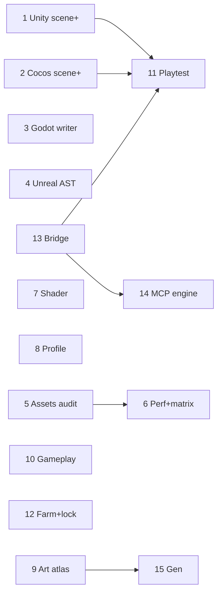

# Phase 14 — 游戏开发能力深化（Game-dev Depth）

> 目标：把 SparkCLI 从"通用 AI CLI 装上 game flavor"升级成"懂引擎、懂资源、懂性能"的真正游戏开发助手。Phase 13 完成了与 Claude Code 的功能对齐，本 Phase 把差异化优势打深——所有差异化都集中在游戏开发的 hands-on 能力上。
>
> 完成后版本切 **0.3.0**（feature 级跃进，无 BREAKING）。

## Status

| # | 类目 | 项目 | Status |
|---|------|------|--------|
| 1 | engine.unity | 场景图 writer 深化（嵌套字段、prefab、Component 链） | ✅ |
| 2 | engine.cocos | 场景写入扩展（reorder/duplicate/delete + UUID 引用扫描） | ✅ |
| 3 | engine.godot | `tscn` writer + GDScript 静态检查 | ✅ |
| 4 | engine.unreal | `.uproject` 模块图 + C++ AST 索引（tree-sitter） | ✅ |
| 5 | assets | `spark-cli assets audit` + `assets fix`（纹理/音频/模型） | ✅ |
| 6 | validate | 性能/内存 lint + 跨平台 limits（抖音/支付宝/华为） | ✅ |
| 7 | shader | Shader lint + 跨语言翻译 + 材质 audit | ✅ |
| 8 | profile | `profile_capture` / `profile_analyze` / `frame_budget_check` | ✅ |
| 9 | art | Spritesheet/Atlas + Spine/DragonBones/Lottie 接入 | ✅ |
| 10 | gameplay | Tilemap import + 数值表 ↔ 配置互转 + 难度曲线 | ✅ |
| 11 | qa | Gameplay replay/playtest（输入回放 + headless smoke） | ✅ |
| 12 | workflow | Multi-agent farm + staging 文件锁 | ✅ |
| 13 | bridge | Unity / Unreal Editor Bridge 双向打通 | ✅ |
| 14 | mcp | Editor 能力反向 MCP 暴露（Profiler / Bake / Frame Debugger） | ✅ |
| 15 | gen | 图像/音效生成 provider 接入（OpenAI-compatible 抽象） | ✅ |

15 项，预计周期 6–8 周。下面按类目拆解，每项都给"动机 / 现状 / 交付 / 测试"四段。

## 设计原则（本 Phase 必须坚持）

- **不破坏 staging 不变量**：所有引擎写入仍走 `.spark-cli/staging/`，新工具不许直接 patch 项目文件。
- **不引入重型依赖**：tree-sitter / 图像生成等可选依赖走 `optionalDependencies`，启动时探测，缺失时降级而非崩。
- **Engine adapter 而非 hard-fork**：每个引擎的能力集中在 `src/engines/<engine>/<capability>.ts`，与 `engines/registry.ts` 注册的元数据保持一致；不在 `src/core/` 里写 engine-specific 分支。
- **每个新工具进 `tools/index.ts`**：保持 `spark-cli doctor --json` 的 `parity.tools` 列表持续增长。
- **Skill-first**：能用 Skill 表达的步骤优先做成 Skill（放进 `knowledge/` 或 bundled `skills/`），让 agent 自学，不写死在 prompt 里。

---

## Deliverables

### 1. Unity 场景图 writer 深化（engine.unity）

- **动机**：现状 `setUnitySceneProperty` 只能改顶层 YAML scalar（`m_Name: foo`），改 `m_LocalScale.x` 要用户手拼路径；prefab instance / nested prefab 完全无法 patch。
- **现状**：`src/engines/unity/scene-graph.ts`（按 `--- !u!classId &fileId` 切分），`scene-writer.ts` 走 `stageWriteFile`。
- **交付**：
  - `setNestedProperty(scene, fileId, path, value)`：path 形如 `m_LocalScale.x` / `m_Component[2].component.fileID`。引入最小 YAML 路径解析器（不引 `js-yaml`，复用 line-based 格式 + 缩进追踪）。
  - `addComponent` 升级：识别 MonoBehaviour 反射字段，补 `m_Script: {fileID, guid}` 链路与 GameObject 的 `m_Component` 数组同步追加。
  - `replacePrefabInstance(scene, instanceFileId, newPrefabGuid)`：处理 `PrefabInstance` 的 `m_SourcePrefab` + `m_Modifications`。
  - 新 MCP 工具：`unity_scene_set_nested`, `unity_scene_replace_prefab`, `unity_scene_remove_component`。
- **测试**：fixtures `tests/fixtures/unity-mini/Assets/Scenes/Battle.unity`（最小有 prefab instance 的场景）+ 三组快照测试。

### 2. Cocos 场景写入扩展（engine.cocos）

- **动机**：现在能 add_node / component_update，但删/复制/重排都没有；删一个 node 时跨场景的 prefab 引用会断，没有预检。
- **现状**：`src/engines/cocos/scene-writer.ts`。
- **交付**：
  - `removeSceneNode(path, nodePath, { force })`：默认拒绝删除被其他场景/prefab 引用的节点；`force: true` 才放行并打印影响清单。
  - `duplicateSceneNode(path, nodePath, { newName })`：深拷贝 + UUID 重写 + 子节点 UUID 重写。
  - `reorderSceneChildren(path, parentPath, order[])`。
  - `scanUuidReferences(projectRoot, uuid)`：遍历 `assets/**/*.{scene,prefab}` 找出引用清单（用作上面 force 校验）。
- **测试**：`scene-writer.test.ts` 扩展三组快照 + 一组「删被引用节点应抛 RefIntegrityError」。

### 3. Godot `tscn` writer + GDScript 静态检查（engine.godot）

- **动机**：现状 `parseGodotScene` 能读但写不了，agent 改不了 .tscn。
- **现状**：`src/engines/godot/scene-parser.ts`、`build.ts`、`validate.ts`。
- **交付**：
  - `src/engines/godot/scene-writer.ts`：`addNode(path, parentPath, type, name)`、`setNodeProperty`、`connectSignal(from, signal, to, method)`，全部走 staging。
  - `src/engines/godot/gdscript-lint.ts`：用纯文本规则（无外部依赖）检 `func _ready` 误拼、`@onready` 上下文、未释放的 `await`、未 disconnect 的 signal。
  - 新 MCP 工具：`tscn_set_property`, `tscn_add_node`, `tscn_connect_signal`, `gdscript_lint`。
- **测试**：`fixtures/godot-mini/scenes/Main.tscn` + lint fixture。

### 4. Unreal `.uproject` 模块图 + C++ AST（engine.unreal）

- **动机**：Unreal 现状只到「认得出 .uproject」，agent 没有任何对 C++/blueprint 的语义索引。
- **现状**：`src/engines/unreal/detector.ts`, `build.ts`, `template-gen.ts`，无解析器。
- **交付**：
  - `src/engines/unreal/uproject-graph.ts`：解析 `.uproject` + `*.Build.cs` + `*.Target.cs`，生成 `{ modules: [{ name, type, deps[] }] }`。
  - `src/engines/unreal/cpp-index.ts`：`tree-sitter-cpp` 作为 optional dep；缺失时降级到正则提取 `UCLASS` / `UFUNCTION` / `UPROPERTY`。提供 `findUClass(name)` / `listUFunctions(class)` 接口。
  - 新工具：`unreal_module_graph`, `unreal_cpp_outline`, `unreal_find_uclass`。
  - **不在本 Phase 解析 .uasset / .umap 二进制**——明确写进 Out of scope。
- **测试**：`fixtures/unreal-mini/` 包含 1 个最小 game module + 1 个 UCLASS。

### 5. `spark-cli assets audit` + `assets fix`（assets）

- **动机**：`src/core/assets/scanner.ts` 只是文件遍历，不出诊断。游戏开发的"有未压缩贴图""未引用资源""超规格音频"是日常痛点。
- **现状**：scanner 只列文件元数据。
- **交付**：
  - 新文件 `src/core/assets/audit.ts`：
    - 纹理：用 `pngjs` / `sharp`（optional）读宽高，规则：`>2048` warn、非 2 的幂 warn（小游戏）、未压缩 PNG 标 hint。
    - 音频：用 `music-metadata`（optional）读采样率/比特率/时长，规则：`sampleRate > 44100` warn、`durationSec > 30` 且非流式 warn。
    - 模型：FBX 不深解析，统计文件大小阈值；GLB 用现成 `@gltf-transform/core`（optional）出三角面/骨骼数。
    - 未引用：联合扫描场景/脚本里的 UUID/路径，列出 dangling assets。
  - 新命令 `spark-cli assets audit [--json]`、`spark-cli assets fix --rule <id> [--apply]`（fix 默认走 staging）。
  - 新工具：`assets_audit`, `assets_fix`。
  - 输出 JSON shape：`{ rule, severity, path, message, suggestion }[]`。
- **测试**：fixtures 包含一张 4096×4096 PNG、一段 48kHz wav，断言出 warn。

### 6. 性能/内存 lint + 跨平台 limits（validate）

- **动机**：当前 `wechat-limits.ts` 只覆盖微信。抖音/支付宝/华为/快手都有各自 limits，开发者需要一条命令出全平台 matrix。
- **现状**：`src/core/validate/wechat-limits.ts`, `platform-rules.ts`（已收 rule 文件，但未消费完整）。
- **交付**：
  - `src/core/validate/perf-lint.ts`：基于 ts-morph 的轻量规则（避免大依赖时退化到正则）：
    - `update()` / `tick()` / `_process()` 内 `new` 分配。
    - `setInterval` / `setTimeout` 无对应 `clear`。
    - 节点 destroy 后仍被 closure 引用（启发式）。
    - 事件监听 `on(...)` 缺 `off`。
  - `src/core/validate/platform-matrix.ts`：消费 `rules/*.json`，对单个项目跑出 `{ platform, rule, status, message }[]`。
  - 新命令 `spark-cli validate --perf` / `spark-cli adapt matrix [--json]`。
  - 新工具：`perf_lint`, `platform_matrix`。
- **测试**：fixtures 注入"`update` 里 new"、"`setInterval` 漏 clear"，断言命中。

### 7. Shader 工作流（shader）

- **动机**：跨平台 shader 是真痛点；SparkCLI 没有任何 shader 协助。
- **交付**：
  - `src/core/shader/lint.ts`：规则集——精度限定符、tex2D/sampler2D 兼容性、gl_FragColor 在 GLSL ES 3 弃用、CocosUSL 平台标签。
  - `src/core/shader/translate.ts`：基于 `naga` / `glslang` 走 `optionalDependencies`；缺失时用规则集做 best-effort + 标 `unsafe`。
  - `src/core/shader/material-audit.ts`：扫描材质引用，检测重复 keyword、过度 over-shading（多 pass 阈值）。
  - 工具：`shader_lint`, `shader_translate(target='hlsl|glsl|metal|wgsl')`, `material_audit`。
- **测试**：3 个 shader fixture（HLSL / GLSL / USL）+ 翻译 round-trip 断言。

### 8. 性能画像（profile）

- **动机**：让 SparkCLI 不只是"代码助手"——成为"性能助手"。
- **交付**：
  - `src/core/profile/capture.ts`：
    - Unity：拉起 `Unity -batchmode -profilerOutput`（已配置 unityPath 时）。
    - Cocos：浏览器侧 hook（提供 `--inject` 注入脚本，输出 perf.json）。
    - Godot：`--profile-server` 模式 + 客户端拉取。
  - `src/core/profile/analyze.ts`：把 profile JSON 切片成 `{ system, frame, ms, samples }`，agent 友好的 schema。
  - `src/core/profile/budget.ts`：给定 `target_fps`，对照 frame budget 报警。
  - 工具：`profile_capture`, `profile_analyze`, `frame_budget_check`。
  - 新命令：`spark-cli profile capture/analyze/budget`。
- **测试**：用静态 fixture profile JSON（不真的拉 Unity），断言 analyze + budget 输出。
- **Out of scope（明确）**：真的拉起 Unity headless—只在 `--exec` 显式给路径时尝试，CI 跳过。

### 9. 美术工作流（art）

- **动机**：Figma/Sketch import 已是占位 UI，再往前一步是"真能产出能用的 atlas / spine prefab"。
- **交付**：
  - `src/core/art/atlas.ts`：用 `maxrects-packer`（optional）出 sprite atlas + 配置文件（cocos `.plist`、unity `SpriteAtlas`、godot `AtlasTexture`）。
  - `src/core/art/spine-import.ts`：解析 Spine `.json` + `.atlas`，在 staging 里生成对应引擎的 prefab（cocos `sp.Skeleton`、unity `SkeletonAnimation` 占位）。
  - `src/core/art/dragonbones-import.ts`、`src/core/art/lottie-import.ts`：同结构。
  - 工具：`atlas_pack`, `spine_import`, `dragonbones_import`, `lottie_import`。
- **测试**：fixtures 含一个 5-sprite + Spine demo，断言 atlas 和 prefab 落 staging。

### 10. 关卡/数值（gameplay）

- **动机**：`level/template.ts` 只能从文本生模板，离"可玩"差关键一步。
- **交付**：
  - `src/core/gameplay/tilemap.ts`：导入 Tiled `.tmx` / Unity `Tilemap` / Godot `TileMap`，统一 IR：`{ layers: [{ tiles, collision }] }`。
  - `src/core/gameplay/balance.ts`：CSV/Excel ↔ JSON ↔ ScriptableObject `.asset` 互转 + diff（diff 用列级显示，dropped row 标红）。
  - `src/core/gameplay/difficulty.ts`：基于现有关卡指标（敌人 HP/伤害/数量）拟合曲线，建议下一关数值。
  - 工具：`tilemap_import`, `balance_convert`, `balance_diff`, `difficulty_suggest`。
- **测试**：CSV/JSON round-trip + Tiled 最小 fixture。

### 11. Gameplay replay / playtest（qa）

- **动机**：现在 `replay/export.ts` 只是 prompt 录制；游戏侧的"录帧 → 回放跑一遍 → 比较输出"在 CI 非常值钱。
- **交付**：
  - `src/core/playtest/protocol.ts`：定义 `PlaytestSession` 二进制格式（输入序列 + RNG seed + 关键 event 时间戳）。
  - `src/core/playtest/runner.ts`：读 session 文件，调用引擎 bridge 进 PlayMode 跑帧，比较终态。
  - 工具：`playtest_record`, `playtest_replay`, `playtest_compare`。
  - 新命令：`spark-cli playtest record|replay|compare`。
  - **依赖**：需要引擎侧 bridge 配合（part of #13）；本 Phase 先做 CLI 协议 + Cocos bridge 的最小实现，Unity/Unreal 标 best-effort。
- **测试**：mock playtest session，断言 replay 输出匹配。

### 12. Multi-agent farm + staging 锁（workflow）

- **动机**：复杂任务可以拆给多个 sub-agent 并行（"美术 agent 调 atlas，gameplay agent 调战斗"），但当前 staging 不防双写。
- **交付**：
  - `src/core/staging/locks.ts`：`acquireLock(projectRoot, paths[], owner)` 写 `.spark-cli/staging/locks.json`，过期 30 min。
  - `task` 工具升级：可声明 `--needs <path glob>`，runner 自动加锁；释放在 sub-agent 退出。
  - 新命令：`spark-cli agent farm <plan.yaml>`：从 yaml 读多个 sub-agent 任务图（节点 = subagent，edge = depends_on），并行执行。
  - 工具：`farm_run`, `lock_status`。
- **测试**：双 sub-agent 抢同一文件，第二个等到 lock 释放再执行。

### 13. Editor Bridge 双向打通（bridge）

- **动机**：现在 Cocos 单向（CLI 控 editor）；Unity bridge 是空壳；Unreal 完全没有。
- **交付**：
  - `extensions/spark-cli-bridge`（Cocos）：补 `playmode_start/stop`、`console_subscribe`（warning/error 流回 CLI）。
  - `packages/unity/com.spark-cli.bridge`：补 EditorWindow + WebSocket client，能力 = Cocos 持平。
  - 新建 `packages/unreal/SparkCLIBridge`（UPlugin）：先做 readonly（select、console），写能力延后。
  - CLI 工具：`editor_playmode_start/stop`, `editor_console_tail`。
- **测试**：扩展跑在测试用 Cocos 项目里，e2e 断言 console 流过来。

### 14. Editor 能力反向 MCP 暴露（mcp）

- **动机**：让 Cursor / Claude Desktop 能直接调"在 Unity 里 Bake Lighting"——把 in-engine 能力通过 SparkCLI 的 MCP server 反向给出去。
- **交付**：
  - `src/mcp/engine-tools.ts`：把 #13 的 bridge 能力包装成 MCP 工具：`unity_bake_lighting`、`cocos_build_scene`、`unreal_compile_blueprint`（如可用）。
  - `spark-cli doctor` 输出哪些 engine MCP tool 当前可用。
- **测试**：mock bridge 后跑 MCP `tools/list`，断言新工具出现在引擎 tool pack 里。

### 15. 图像/音效生成 provider（gen）

- **动机**：当前 vision 只能"看"。游戏占位资源（图标/SFX）需要"造"。
- **交付**：
  - `src/core/providers/image-gen.ts`：抽象 `ImageGenProvider`（参照 `openai-compatible.ts` 风格），首发支持 OpenAI Images / Stability。
  - `src/core/providers/audio-gen.ts`：同抽象，首发支持 ElevenLabs SFX。
  - `spark-cli asset generate-icon "8-bit fire wand" --size 64x64`：生成后落 staging + 选填自动入 atlas（依赖 #9）。
  - 工具：`asset_generate_image`, `asset_generate_audio`。
  - 配置：`tools.gen.image.provider` / `tools.gen.audio.provider`，默认 disabled，与 web 工具同样的 opt-in 风格。
- **合规**：在文档中写明生成式资源的版权风险；agent prompt 里加 `(non-commercial placeholder unless user verifies provider terms)`。
- **测试**：mock provider，断言 staging 出文件 + manifest 标 `gen.source`。

---

## 依赖关系



并行性：T1–T4（各引擎独立）、T5–T7（独立）、T9–T10（独立）、T15 可全程并行（不依赖引擎）。T11/T14 依赖 T13，建议靠后。

---

## 验收

```bash
pnpm typecheck
pnpm test
pnpm build
pnpm test:phase14   # 新增

# 引擎层（fixture-based）
spark-cli validate --perf -P fixtures/cocos-3.8-mini   # 至少 1 个 perf warn
spark-cli assets audit -P fixtures/unity-mini --json | jq '.findings | length'
spark-cli adapt matrix -P fixtures/cocos-3.8-mini --json | jq '.platforms | length'  # 4

# 资源/性能
spark-cli profile analyze fixtures/profiles/sample.json --json
spark-cli shader translate fixtures/shaders/test.hlsl --target glsl

# 工具面
spark-cli doctor --json | jq '.parity.tools.count'   # ≥ Phase 13 + 25
```

新增 `scripts/phase14-accept.mjs`（结构与 Phase 13 同型），加进 `package.json` 的 `test:phase14`。

完成全部条目后：
- 所有 Status 列 ✅
- `package.json` 版本 `0.2.x` → `0.3.0`
- `CHANGELOG.md` 增 `[0.3.0]` 节
- ROADMAP 表追加 Phase 14 行

---

## Out of scope（明确不做）

- **Unreal `.uasset` / `.umap` 二进制解析**：协议复杂、版本敏感；需要时优先走 Editor Bridge（#13）而不是离线解析。
- **真实 LLM 联网测试**：仍由 mocked agent 覆盖。
- **生成式资源的版权审核管线**：本 Phase 只做技术接入 + 文档警示，合规审核交给用户。
- **MoCap / 3D 资产生成**：超出 Phase 14 范围，延后到独立 Phase。
- **真实 SparkCLI Cloud 后端**：与 Phase 11 mock 边界一致，不动。
- **Skill 市场 / 团队级 memory 共享**：依赖真实 Cloud，延后。

---

## 与 Phase 13 的关系

Phase 13 的目标是"功能对齐 Claude Code"，做的是 agent 的"通用能力"（todo / memory / web / worktree / cron / ask_user_question）。
Phase 14 的目标是"成为最懂游戏开发的 AI CLI"，做的是"垂直能力"——同一个 agent loop，更深更专的工具集。

两者正交，互不替代。
