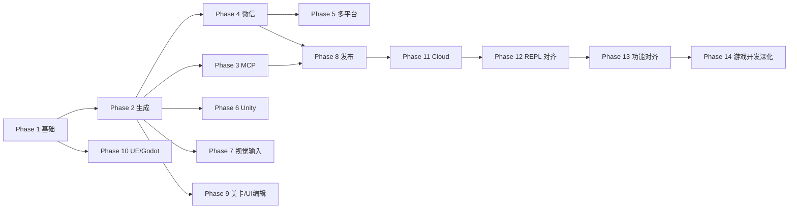

# SparkCLI 开发路线图（Phase 制）

> **原则**：先在本文件与 `PHASE-N.md` 中定义范围与验收，**只开发当前 Phase** 内的内容。  
> 产品设计全文见 [SparkCLI-产品设计文档.md](../SparkCLI-产品设计文档.md)（愿景）；**执行以本路线图为准**。

## 当前状态（2026-05）

| Phase | 名称 | 状态 | 说明 |
|-------|------|------|------|
| **1** | 基础框架 | ✅ **已完成** | 见 [PHASE-1.md](./PHASE-1.md) |
| **2** | 生成与场景 | ✅ **已完成** | 见 [PHASE-2.md](./PHASE-2.md) |
| **3** | MCP 与桥接 | ✅ **已完成** | 见 [PHASE-3.md](./PHASE-3.md) |
| **4** | 微信构建/适配 | ✅ **已完成** | 见 [PHASE-4.md](./PHASE-4.md) |
| **5** | 多平台 adapt | ✅ **已完成** | 见 [PHASE-5.md](./PHASE-5.md) |
| **6** | Unity 对等 | ✅ **已完成** | 见 [PHASE-6.md](./PHASE-6.md) |
| **7** | 识图/Figma | ✅ **已完成** | 见 [PHASE-7.md](./PHASE-7.md) |
| **8** | 质量/发布 | ✅ **已完成** | 见 [PHASE-8.md](./PHASE-8.md) |
| **9** | 关卡/Anim/Editor | ✅ **已完成** | 见 [PHASE-9.md](./PHASE-9.md) |
| **10** | Unreal/Godot | ✅ **已完成** | 见 [PHASE-10.md](./PHASE-10.md) |
| **11** | Cloud | ✅ **已完成** | 见 [PHASE-11.md](./PHASE-11.md) |
| **12** | Claude Code REPL 对齐 | ✅ **已完成** | 见 [PHASE-12.md](./PHASE-12.md) |
| **13** | 功能对齐 Claude Code（BREAKING → 0.2.0） | ✅ **已完成** | 见 [PHASE-13.md](./PHASE-13.md) |
| **14** | 游戏开发能力深化（→ 0.3.0） | ⏳ **进行中** | 见 [PHASE-14.md](./PHASE-14.md) |

**路线图 Phase 1–13 已全部完成。** Phase 14（游戏开发能力深化：四引擎 writer/lint 加深、资产/性能/Shader 流水线、profile/atlas/tilemap、replay/playtest、multi-agent、Unity/Unreal Bridge 反向 MCP、image/audio gen，目标 0.3.0，**无 BREAKING**）见 [PHASE-14.md](./PHASE-14.md)。

---

## Phase 总览

| Phase | 周期（估） | 目标一句话 | 文档 |
|-------|------------|------------|------|
| 1 | 2 周 | 能装、能配模型、能 chat 并安全写文件 | [PHASE-1.md](./PHASE-1.md) |
| 2 | 3 周 | 生成 gen/ui、场景分析、knowledge、memory、校验增强 | [PHASE-2.md](./PHASE-2.md) |
| 3 | 2 周 | MCP 完整只读/可写策略、Editor Bridge 原型 | [PHASE-3.md](./PHASE-3.md) |
| 4 | 2 周 | 微信构建/适配/发布、asset 命令 | [PHASE-4.md](./PHASE-4.md) |
| 5 | 2 周 | 抖音/支付宝等 adapt 规则 | [PHASE-5.md](./PHASE-5.md) |
| 6 | 3 周 | Unity 对等能力 | [PHASE-6.md](./PHASE-6.md) |
| 7 | 2 周 | 识图/Figma/Sketch 输入 | [PHASE-7.md](./PHASE-7.md) |
| 8 | 2 周 | replay、plugin、npm 发布、全量验收 | [PHASE-8.md](./PHASE-8.md) |
| 9 | 3 周 | level/anim、editor Web UI | [PHASE-9.md](./PHASE-9.md) |
| 10 | 4 周 | Unreal/Godot 内置 | [PHASE-10.md](./PHASE-10.md) |
| 11 | 3 周 | SparkCLI Cloud | [PHASE-11.md](./PHASE-11.md) |
| 12 | 2 周 | Claude Code REPL 对齐 | [PHASE-12.md](./PHASE-12.md) |
| 13 | 1 周 | 功能对齐 Claude Code（BREAKING） | [PHASE-13.md](./PHASE-13.md) |
| 14 | 4 周 | 游戏开发能力深化（writer/assets/profile/replay/bridge/gen） | [PHASE-14.md](./PHASE-14.md) |

---

## 开发流程（必须遵守）

```
1. 阅读 docs/ROADMAP.md → 确认当前 Phase N
2. 只修改 PHASE-N.md 中「本 Phase 交付」列表内的项
3. 每项完成后在 PHASE-N.md 打勾
4. 满足「Phase N 验收」全部条目 → 在 ROADMAP 将 Phase N 标为 ✅
5. 再打开 Phase N+1，不得跳过
```

**例外**：修 bug、文档、测试可归入当前 Phase；**新命令/新模块** 必须属于当前 Phase 或先修订 `PHASE-N.md` 并经确认（扩大范围）。

---

## 代码与 Phase 错位说明（诚实记录）

此前按「继续做」迭代时，部分 **Phase 2/3** 能力已提前写入仓库：

| 能力 | 设计 Phase | 代码现状 |
|------|----------|----------|
| `gen` / `ui` / `scene` | 2 | 已有 |
| `mcp serve`（只读） | 3 | 已有 |
| `knowledge` / `memory` | 2 | **未做** |
| Editor Bridge | 3 | **未做** |
| `build` / `adapt` | 4 | **未做** |

**处理方式**：不删已写代码；在 Phase 2/3 验收时视为「已完成项」勾掉，**补齐该 Phase 其余未做项** 后再进入下一 Phase。

---

## 依赖关系



Phase 6/7/9/10 在 Phase 4 之后可并行，但 **不得早于 Phase 2 完成**（依赖生成与校验链路）。
